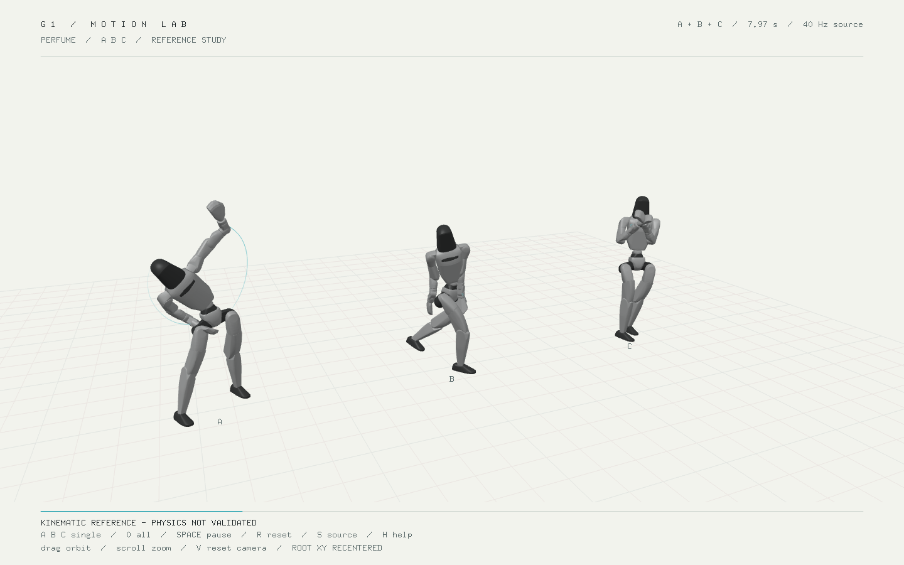
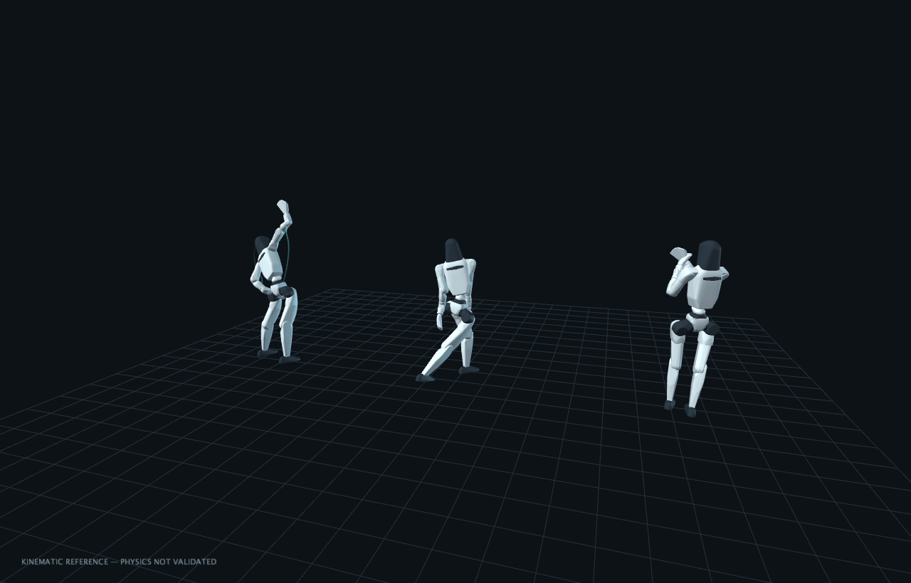
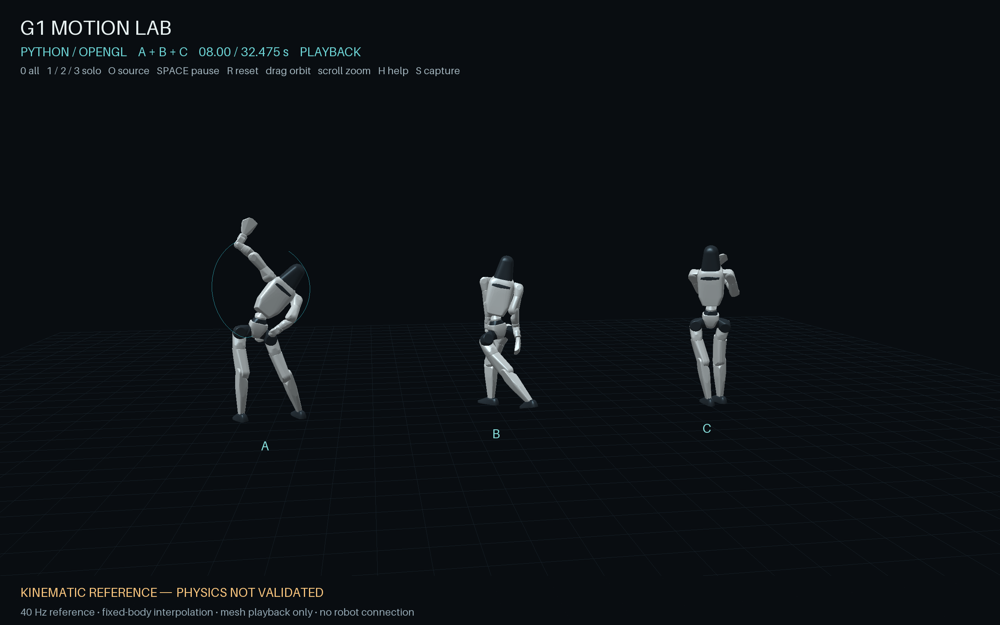

# Standalone repository verification

The following checks were run on macOS arm64 on 2026-09-06 against the new
repository layout. They verify packaging, data integrity and actual graphics;
they are not new retarget solves or physical-robot approval.

| Component | Result |
| --- | --- |
| Canonical package | All eight source/reference assets match their original SHA-256 and byte lengths; A/B/C remain 1,299 samples at 40 Hz |
| Data preparation | Five tests pass, including idempotence, edited-file preservation, escaping-symlink rejection and all eight retarget-module snapshot hashes |
| Retarget contracts | 37 tests pass in isolated Python 3.12.13 with the pinned direct dependencies; dependency compatibility check passes; no motion solve or model download |
| openFrameworks 0.12.1 | Make Release and Xcode application Release pass; four packaging tests, four real hidden-window captures and 22 rejected-input cases pass |
| Processing 4.5.6 | Three Java/fixture test methods, five real captures and 20 rejected-input cases pass; all five rendered PNGs match the original accepted captures byte-for-byte |
| Python viewer | 17 numeric/loader tests pass, including 23 malformed-input subcases; seven actual hidden-window render cases and two CLI rejection cases pass; controls, resize and scene-only animation/overlay differences are checked |

The Xcode check rebuilt the application using an already-built OF core. It
does not claim a fresh local core build. GitHub CI separately builds OF in its
own environment. Linux rendering uses Mesa llvmpipe and Xvfb, not a hardware
robot or a physics simulator.

The OF suite preserves the previously measured 240-second positive-capture
watchdog and 90-second negative-case watchdog. No rendering acceptance criteria,
source poses or validation gates were loosened to make the migration pass.

## Actual standalone captures







These are captures from the migrated applications, not generated concept images.
The on-screen kinematic/physics warning remains visible. Check the
[workflow runs](https://github.com/perfume-dev/g1-motion-lab/actions/workflows/verify.yml)
for each published revision's independent build/render result and downloadable
logs and captures. A green graphics check is never physical tracking approval.

## Reproduce

From the repository root:

```sh
python3 scripts/prepare-data.py --check
python3 -m unittest discover -s tests/data -v
python3 -m unittest discover -s tests/openframeworks -v
./scripts/build-openframeworks.sh /absolute/path/to/openFrameworks
./scripts/verify-openframeworks.sh artifacts/of
./scripts/verify-processing.sh /absolute/path/to/Processing artifacts/processing
uv sync --frozen --project examples/python --python 3.12
bash scripts/verify-python.sh artifacts/python
```

See each viewer's README for platform dependencies and its interactive controls.
Test output is ignored under `artifacts/`; negative cases use disposable copies.
The original measured pose/physical limitations remain separately documented
in [VALIDATION.md](VALIDATION.md), with unchanged reports in `data/reference`.
